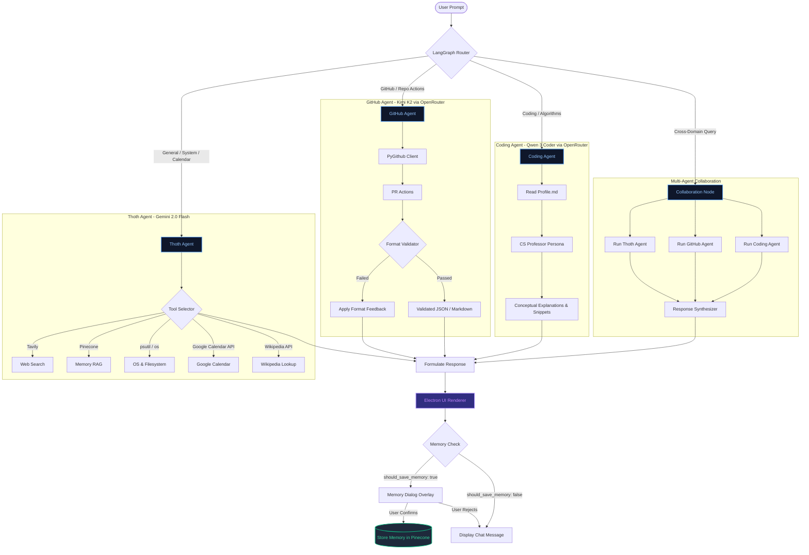

# 🦉 Thoth AI Companion

Thoth is a personalized, desktop-native AI companion and development partner built specifically by and for **Hari**. Combining a highly responsive desktop frontend with a robust multi-agent backend, Thoth manages schedules, explores project files, queries documentation, conducts code reviews, and learns from previous conversations through semantic memory.

---

## 🚀 Key Features

*   **Intelligent Multi-Agent Routing (LangGraph):** Automatically orchestrates queries between specialized agents depending on intent—routing coding questions to a computer science educator agent, pull requests to a GitHub analyst agent, and system or search actions to the core assistant.
*   **Persistent Semantic Memory (RAG via Pinecone):** Summarizes conversation topics, prompts the user to save new knowledge, generates `384-dimensional` embeddings using `sentence-transformers`, and recalls past context during active chats.
*   **Developer Profile Integration:** Anchors its explanations to Hari's background, education, current projects (e.g., 2D Canvas engine), and learning focus (Electron, Tauri, Monorepos).
*   **System & Filesystem Tooling:** Allows Thoth to read files, view directory structures, inspect CPU/Memory/Disk utilization, and launch local software applications.
*   **Google Calendar & Productivity Integration:** Accesses upcoming meetings, schedules events, and queries calendar details automatically.
*   **Elegant Desktop Client:** Built with Electron, Vite, TypeScript, and a Gemini-inspired chat UI complete with responsive layouts, Markdown syntax support, and code copy capability.

---

## 🗺️ System Flow & Architecture

Thoth's backend processes queries through a centralized LangGraph workflow, routing questions to specialized agents and returning structured JSON payloads for the Electron frontend.



---

## 🛠️ Tech Stack

### Backend
*   **FastAPI:** Asynchronous API service handling frontend communications.
*   **LangChain & LangGraph:** Multi-agent coordination, state management, and ReAct agent structure.
*   **PyGithub & OpenRouter API:** Connects to GitHub repositories for pull request management, using models like `moonshotai/kimi-k2:free` and `qwen/qwen3-coder:free`.
*   **Pinecone & Sentence-Transformers (`all-MiniLM-L6-v2`):** Vector database index and embeddings engine for conversation history retrieval.
*   **Google APIs:** Integrations for Google Calendar operations.

### Frontend
*   **Electron:** Desktop framework running the user application shell.
*   **Vite & TypeScript:** Quick development builds and type safety.
*   **Prism.js:** Client-side syntax highlighting for code blocks.
*   **HTML5 / Vanilla CSS:** High-performance, customizable layouts with smooth gradients and glassmorphic dialogs.

---

## 📂 Project Structure

```text
Thoth/
├── thoth_backend/             # FastAPI Backend Service
│   ├── main.py                # Server entry point & CORS configuration
│   ├── functions.py           # API route mappings (generate, collaborative, memory)
│   ├── collaborative_agent.py # LangGraph workflow, routing logic, response synthesis
│   ├── langchain_agent.py     # Core Thoth agent (Gemini 2.0 Flash + ReAct tools)
│   ├── github_agent.py        # GitHub analytics agent (Kimi K2 + PyGithub)
│   ├── coding_agent.py        # Educational coding agent (Qwen 3 Coder + Profile loading)
│   ├── vector_db.py           # Pinecone vector database client & embeddings setup
│   ├── tools.py               # Built-in agent tools (calendar, bash, search, system stats)
│   ├── profile.md             # Developer resume, strengths, and goals for personalization
│   ├── requirements.txt       # Python dependencies
│   └── Dockerfile             # Container configuration
└── thoth_frontend/            # Electron Desktop Frontend
    ├── package.json           # npm configuration
    ├── tsconfig.json          # TypeScript rules
    ├── index.html             # Application chat window layout & rendering logic
    ├── src/
    │   ├── main.ts            # Electron main process (lifecycle & window startup)
    │   ├── preload.ts         # Main-to-renderer bridge definition
    │   ├── renderer.ts        # Vite renderer entry
    │   ├── aiAgent.ts         # Backend API client bridge
    │   └── index.css          # Styling tokens, responsive animations, and custom styling
    └── forge.config.ts        # Electron Forge packager configuration
```

---

## ⚙️ Installation & Setup

### Prerequisites
*   Python 3.10 or higher
*   Node.js v18 or higher & npm
*   Pinecone Database Index (Dimension: 384)
*   API keys for Google Gemini, OpenRouter, Tavily, and Pinecone

### 1. Backend Setup
1.  Navigate to the backend directory:
    ```bash
    cd thoth_backend
    ```
2.  Create and activate a virtual environment:
    ```bash
    python -m venv venv
    source venv/bin/activate  # On Windows use: venv\Scripts\activate
    ```
3.  Install dependencies:
    ```bash
    pip install -r requirements.txt
    ```
4.  Configure your environment. Create a `.env` file in `thoth_backend/`:
    ```ini
    GEMINI_API_KEY=your_gemini_api_key
    TAVILY_API_KEY=your_tavily_search_api_key
    OPENROUTER_API_KEY=your_openrouter_api_key
    PINECONE_API_KEY=your_pinecone_api_key
    GITHUB_TOKEN=your_github_personal_access_token
    ```
5.  Start the backend service:
    ```bash
    python main.py
    ```
    The API will run locally at `http://localhost:8000`.

### 2. Frontend Setup
1.  Navigate to the frontend directory:
    ```bash
    cd ../thoth_frontend
    ```
2.  Install packages:
    ```bash
    npm install
    ```
3.  Configure backend connection (if deploying/staging):
    Modify the default URL defined in `thoth_frontend/src/aiAgent.ts` or set it in your environment definitions.
4.  Launch the Electron desktop application:
    ```bash
    npm start
    ```

---

## 📄 License
This project is licensed under the MIT License - see the project developer details in the [Profile](thoth_backend/profile.md).
